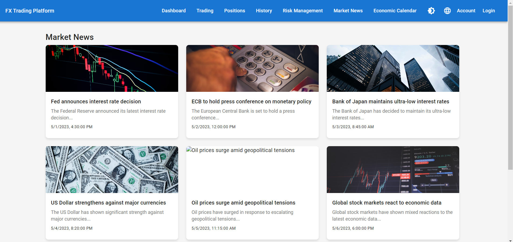

# FX Trading Platform

## Overview



This FX Trading Platform is a modern, responsive web application built with React, designed to provide users with a seamless foreign exchange trading experience.

## DEMO

https://fx-trader-autocode.onrender.com

## Features

- Real-time currency pair quotes
- Order placement (market and limit orders)
- Position management
- Trade history and reporting
- User authentication and account management
- Customizable dashboard
- Dark mode / Light mode toggle
- Advanced charting tools
- Risk management features
- Economic calendar
- Market news integration
- Multi-language support

## Technical Stack

- React.js for frontend development
- MUI5 for UI components
- React Router v6 for navigation
- Fetch API for backend communication
- React Context API for state management
- React Query for data fetching and caching

## Project Structure

```
fx-trading-platform/
├── public/
│   ├── index.html
│   └── landing.html
├── src/
│   ├── components/
│   ├── pages/
│   ├── services/
│   ├── utils/
│   ├── contexts/
│   ├── App.js
│   └── index.js
├── docs/
│   ├── landing_page_copy.html
│   └── social_media_content.json
├── package.json
└── README.md
```

## Design Considerations

- Implement a responsive design for desktop and mobile devices
- Use a modular architecture for easy maintenance and scalability
- Implement lazy loading for improved performance
- Utilize custom hooks for reusable logic
- Implement error boundaries for robust error handling
- Use React Suspense for code-splitting and improved loading states
- Optimize for SEO with React Helmet
- Use React.memo and useMemo for performance optimization
- Implement progressive web app (PWA) features
- Utilize React Context API for global state management
- Implement React Query for efficient data fetching and caching
- Add CI/CD pipeline for automated testing and deployment
- Use React Spring for smooth animations and transitions
- Implement a shared state management solution (e.g., Redux or Recoil) for complex state management
- Utilize CSS-in-JS solutions like styled-components or Emotion for better component styling
- Implement real-time updates using WebSockets or Server-Sent Events
- Implement a design system for consistent UI/UX across the application
- Add keyboard shortcuts for power users
- Implement data visualization libraries (e.g., D3.js or Chart.js) for advanced charting
- Implement a feature flag system for gradual rollout of new features

## New Design Ideas and Considerations

- Implement a micro-frontend architecture for better scalability and team collaboration
- Integrate WebAssembly for high-performance calculations and data processing
- Implement a chatbot using natural language processing for user support
- Add voice commands for hands-free trading operations
- Implement augmented reality features for visualizing market trends
- Integrate machine learning algorithms for personalized trading recommendations
- Implement social trading features for community engagement
- Add push notifications for important market events and trade updates
- Implement multi-factor authentication for enhanced security
- Create a mobile app version using React Native for cross-platform compatibility
- Implement a sandbox environment for paper trading and strategy testing
- Add support for cryptocurrency trading alongside forex
- Implement automated trading strategies using algorithms
- Create a marketplace for custom indicators and trading strategies
- Implement a backtesting tool for historical performance analysis
- Add integration with popular trading platforms (e.g., MetaTrader) for account syncing
- Implement a news sentiment analysis feature for market insights
- Create a portfolio optimization tool using modern portfolio theory
- Implement a risk scoring system for trades and overall account health
- Add support for social media integration for sharing trade ideas and performance

## Performance Optimization

- Implement server-side rendering (SSR) for improved initial load times
- Use IndexedDB for client-side caching of large datasets
- Implement virtual scrolling for long lists of trades or market data
- Use Web Workers for offloading heavy computations
- Implement code-splitting at the route level for faster page loads
- Use service workers for offline functionality and faster subsequent loads
- Implement image lazy loading and optimization techniques
- Use CDN for static assets delivery

## Security Enhancements

- Implement rate limiting to prevent API abuse
- Use HTTPS for all communications
- Implement CSRF protection
- Use secure HTTP headers (e.g., Content Security Policy)
- Implement input validation and sanitization
- Use OAuth 2.0 for third-party integrations
- Implement session management with secure, HttpOnly cookies
- Regular security audits and penetration testing

## Accessibility Considerations

- Implement ARIA attributes for improved screen reader support
- Ensure proper color contrast ratios for all UI elements
- Implement keyboard navigation support throughout the application
- Provide alternative text for all images and icons
- Create an accessibility statement and conformance report

## Internationalization and Localization

- Implement dynamic language switching without page reload
- Use ICU message format for complex translations
- Implement right-to-left (RTL) layout support for applicable languages
- Localize numbers, dates, and currencies based on user preferences

## Analytics and Monitoring

- Implement error tracking and logging (e.g., Sentry)
- Add user behavior analytics for UX improvements
- Implement performance monitoring and real-time alerting
- Create a dashboard for key performance indicators (KPIs)

## Future Roadmap

- Explore blockchain integration for transparent trade settlement
- Investigate AI-driven market analysis and prediction features
- Consider implementing VR trading interfaces for immersive experiences
- Research quantum computing applications for advanced risk modeling